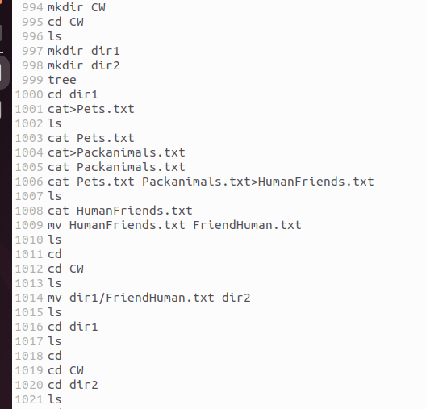
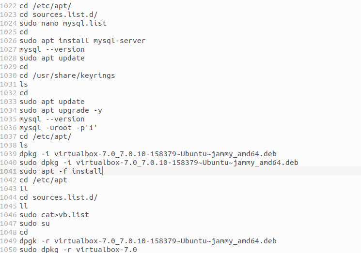

### **1. Используя команду cat в терминале операционной системы Linux, создать два файла Домашние животные (заполнив файл собаками, кошками, хомяками) и Вьючные животными заполнив файл Лошадьми, верблюдами и ослы), а затем объединить их. Просмотреть содержимое созданного файла. Переименовать файл, дав ему новое имя (Друзья человека).**

tatsiana@tatsiana-VirtualBox:\~/CW$ mkdir dir1  
tatsiana@tatsiana-VirtualBox:\~/CW$ mkdir dir2  
tatsiana@tatsiana-VirtualBox:\~/CW$ tree 
```
.  
├── dir1  
└── dir2
```  
tatsiana@tatsiana-VirtualBox:\~/CW$ cd dir1  
tatsiana@tatsiana-VirtualBox:\~/CW/dir1$ cat>Pets.txt 
``` 
dogs  
cats  
hamsters  
```
tatsiana@tatsiana-VirtualBox:\~/CW/dir1$ cat>Packanimals.txt
```  
horses  
camels  
donkeys
```  
tatsiana@tatsiana-VirtualBox:\~/CW/dir1$ cat Pets.txt Packanimals.txt>HumanFriends.txt  
tatsiana@tatsiana-VirtualBox:\~/CW/dir1$ ls
```  
HumanFriends.txt  Packanimals.txt  Pets.txt
```  
tatsiana@tatsiana-VirtualBox:\~/CW/dir1$ cat HumanFriends.txt
```   
dogs  
cats  
hamsters  
horses  
camels  
donkeys 
``` 
tatsiana@tatsiana-VirtualBox:\~/CW/dir1$ mv HumanFriends.txt FriendHuman.txt  
tatsiana@tatsiana-VirtualBox:\~/CW/dir1$ ls
```  
FriendHuman.txt  Packanimals.txt  Pets.txt
```  

### **2. Создать директорию, переместить файл туда.** 

tatsiana@tatsiana-VirtualBox:\~/CW/dir1$ cd  
tatsiana@tatsiana-VirtualBox:\~$ cd CW
tatsiana@tatsiana-VirtualBox:\~/CW\$ ls
```  
dir1  dir2
```  
tatsiana@tatsiana-VirtualBox:\~/CW$ mv dir1/FriendHuman.txt dir2    
tatsiana@tatsiana-VirtualBox:\~/CW$ cd dir1  
tatsiana@tatsiana-VirtualBox:\~/CW/dir1$ ls
```  
Packanimals.txt  Pets.txt
```   
tatsiana@tatsiana-VirtualBox:\~/CW/dir1$ cd  
tatsiana@tatsiana-VirtualBox:\~\$ cd CW
tatsiana@tatsiana-VirtualBox:\~/CW\$ cd dir2  
tatsiana@tatsiana-VirtualBox:\~/CW/dir2$ ls
```  
FriendHuman.txt  
```

### **3. Подключить дополнительный репозиторий MySQL. Установить любой пакет из этого репозитория.**

tatsiana@tatsiana-VirtualBox:\~\$ cd /etc/apt/ 
tatsiana@tatsiana-VirtualBox:/etc/apt$ cd sources.list.d/  
tatsiana@tatsiana-VirtualBox:/etc/apt/sources.list.d$ sudo nano mysql.list  
[sudo] пароль для tatsiana:  
deb http://repo.mysql.com/apt/ubuntu/ bionic mysql-8.0  
(ссылку вставить, сохранить)  
tatsiana@tatsiana-VirtualBox:/etc/apt/sources.list.d$ cd  
tatsiana@tatsiana-VirtualBox:\~\$ sudo apt install mysql-server  
tatsiana@tatsiana-VirtualBox:\~$ mysql --version
```  
mysql  Ver 8.0.35 for Linux on x86_64 (MySQL Community Server - GPL)
```   
установить ключи  
sudo apt update  

### **4. Установить и удалить deb-пакет с помощью dpkg.**  

cd  
wget https://download.virtualbox.org/virtualbox/7.0.10/virtualbox-7.0_7.0.10-158379~Ubuntu~jammy_amd64.deb  
ll  
sudo dpkg -i virtualbox-7.0_7.0.10-158379~Ubuntu~jammy_amd64.deb  
sudo apt -f install  
cd /etc/apt  
ll  
cd sources.list.d/  
ll  
sudo su  
cat > vb.list deb [arch=amd64 signed-by=/usr/share/keyrings/oracle-virtualbox-2016.gpg] https://download.virtualbox.org/virtualbox/debian jammy contrib  
sudo apt update  
sudo apt upgrade –y  
Удалить:  
tatsiana@tatsiana-VirtualBox:\~$ sudo dpkg -r virtualbox-7.0
```  
(Чтение базы данных … на данный момент установлено 230356 файлов и каталогов.)  
Удаляется virtualbox-7.0 (7.0.10-158379~Ubuntu~jammy) …  
Обрабатываются триггеры для shared-mime-info (2.1-2) …  
Обрабатываются триггеры для hicolor-icon-theme (0.17-2) …  
Обрабатываются триггеры для mailcap (3.70+nmu1ubuntu1) …  
Обрабатываются триггеры для gnome-menus (3.36.0-1ubuntu3) …  
Обрабатываются триггеры для desktop-file-utils (0.26-1ubuntu3) …
```

### **5. Выложить историю команд в терминале ubuntu.**



