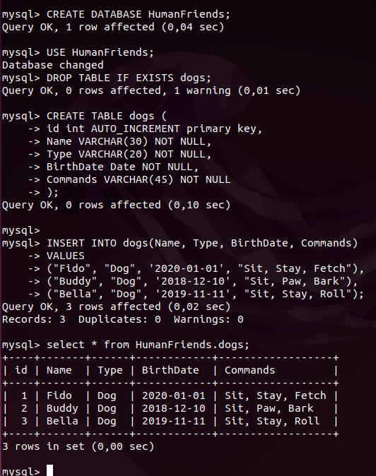
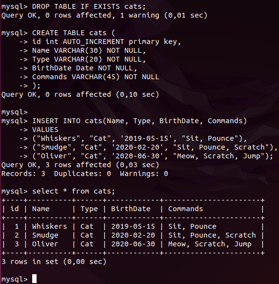
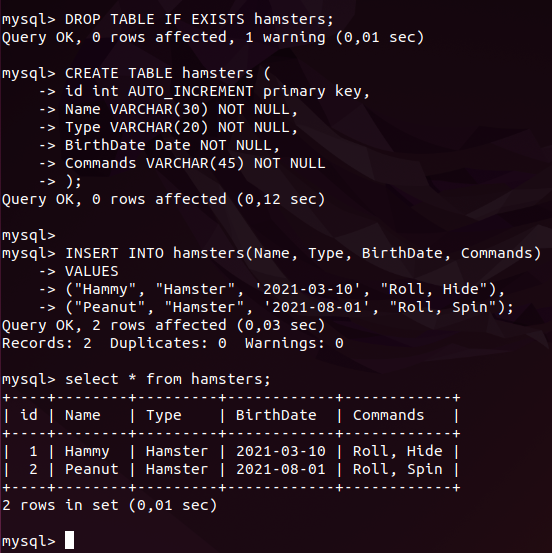
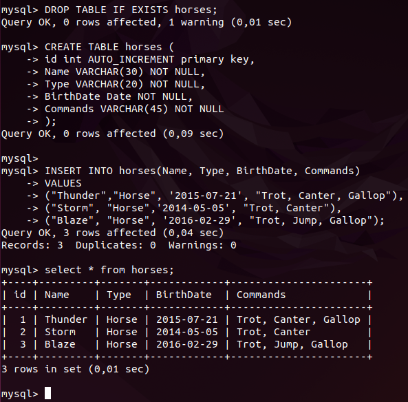
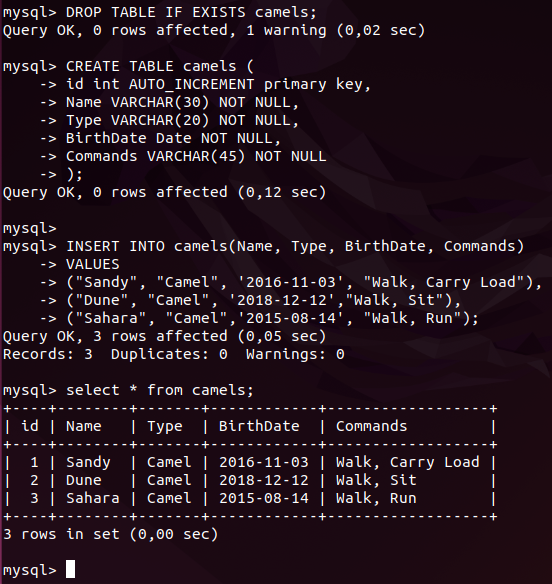

### **7. В подключенном MySQL репозитории создать базу данных “Друзья человека”**
```
CREATE DATABASE HumanFriends;  
USE HumanFriends;
```

### **8. Создать таблицы с иерархией из диаграммы в БД.**  
Тут возникли вопросы. т.к. при постороении схем по предмету "Знакомство с базами данных" много было заданий на зависимости, но в mysql возникли трудности, есть внутренний и внешний ключи, но как конктретно создать иерархию не совсем понятно. Перед работой рассмотрела оба прикреплённых задания, которые и использовала для экономии времени данные были взяты из заданий.  
Изначально создала бы одну большую базу животных, (т.к все коты, собаки наследуются от животных) из которой по необходимости делала бы нужную выборку по критериям, или две домашние животные отдельно, вьючные отдельно. Но в задании написано "заполнить низкоуровневые таблицы данными", "соединить таблицы в одну". 
### **9. Заполнить низкоуровневые таблицы именами(животных), командами которые они выполняют и датами рождения**

Dogs
```
DROP TABLE IF EXISTS dogs;
CREATE TABLE dogs (
id int AUTO_INCREMENT primary key,
Name VARCHAR(30) NOT NULL,
Type VARCHAR(20) NOT NULL,
BirthDate Date NOT NULL,
Commands VARCHAR(45) NOT NULL
);

INSERT INTO dogs(Name, Type, BirthDate, Commands) 
VALUES 
("Fido", "Dog", '2020-01-01', "Sit, Stay, Fetch"),
("Buddy", "Dog", '2018-12-10', "Sit, Paw, Bark"),
("Bella", "Dog", '2019-11-11', "Sit, Stay, Roll");
```


Cats
```
DROP TABLE IF EXISTS cats;
CREATE TABLE cats (
id int AUTO_INCREMENT primary key,
Name VARCHAR(30) NOT NULL,
Type VARCHAR(20) NOT NULL,
BirthDate Date NOT NULL,
Commands VARCHAR(45) NOT NULL
);

INSERT INTO cats(Name, Type, BirthDate, Commands) 
VALUES 
("Whiskers", "Cat", '2019-05-15', "Sit, Pounce"),
("Smudge", "Cat", '2020-02-20', "Sit, Pounce, Scratch"),
("Oliver", "Cat", '2020-06-30', "Meow, Scratch, Jump");
```


Hamsters
```
DROP TABLE IF EXISTS hamsters;
CREATE TABLE hamsters (
id int AUTO_INCREMENT primary key,
Name VARCHAR(30) NOT NULL,
Type VARCHAR(20) NOT NULL,
BirthDate Date NOT NULL,
Commands VARCHAR(45) NOT NULL
);

INSERT INTO hamsters(Name, Type, BirthDate, Commands) 
VALUES 
("Hammy", "Hamster", '2021-03-10', "Roll, Hide"),
("Peanut", "Hamster", '2021-08-01', "Roll, Spin");
```


Horses
```
DROP TABLE IF EXISTS horses;
CREATE TABLE horses (
id int AUTO_INCREMENT primary key,
Name VARCHAR(30) NOT NULL,
Type VARCHAR(20) NOT NULL,
BirthDate Date NOT NULL,
Commands VARCHAR(45) NOT NULL
);

INSERT INTO horses(Name, Type, BirthDate, Commands) 
VALUES 
("Thunder",	"Horse", '2015-07-21', "Trot, Canter, Gallop"),
("Storm", "Horse",	'2014-05-05', "Trot, Canter"),
("Blaze", "Horse", '2016-02-29', "Trot, Jump, Gallop");
```


Camels
```
DROP TABLE IF EXISTS camels;
CREATE TABLE camels (
id int AUTO_INCREMENT primary key,
Name VARCHAR(30) NOT NULL,
Type VARCHAR(20) NOT NULL,
BirthDate Date NOT NULL,
Commands VARCHAR(45) NOT NULL
);

INSERT INTO camels(Name, Type, BirthDate, Commands) 
VALUES 
("Sandy", "Camel", '2016-11-03', "Walk, Carry Load"),
("Dune", "Camel", '2018-12-12',	"Walk, Sit"),
("Sahara", "Camel",	'2015-08-14', "Walk, Run");
```


Donkeys
```
DROP TABLE IF EXISTS donkeys;
CREATE TABLE donkeys (
id int AUTO_INCREMENT primary key,
Name VARCHAR(30) NOT NULL,
Type VARCHAR(20) NOT NULL,
BirthDate Date NOT NULL,
Commands VARCHAR(45) NOT NULL
);

INSERT INTO donkeys(Name, Type, BirthDate, Commands) 
VALUES 
("Eeyore", "Donkey", '2017-09-18', "Walk, Carry Load, Bray"),
("Burro", "Donkey", '2019-01-23', "Walk, Bray, Kick");
```


### **10. Удалив из таблицы верблюдов, т.к. верблюдов решили перевезти в другой питомник на зимовку. Объединить таблицы лошади, и ослы в одну таблицу.**


### **11. Создать новую таблицу “молодые животные” в которую попадут все животные старше 1 года, но младше 3 лет и в отдельном столбце с точностью до месяца подсчитать возраст животных в новой таблице**


### **12. Объединить все таблицы в одну, при этом сохраняя поля, указывающие на прошлую принадлежность к старым таблицам.**


