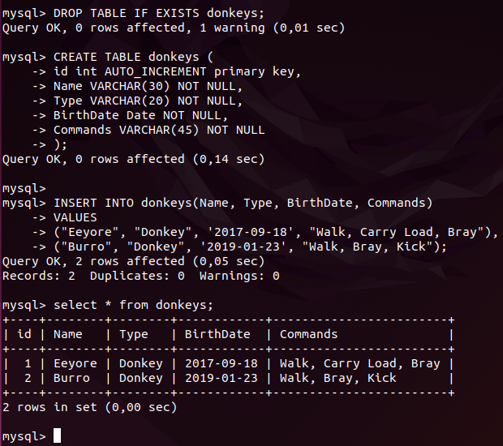
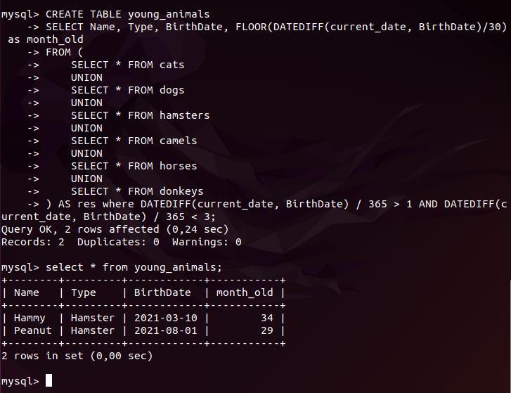

### **7. В подключенном MySQL репозитории создать базу данных “Друзья человека”**
```
CREATE DATABASE HumanFriends;  
USE HumanFriends;
```

### **8. Создать таблицы с иерархией из диаграммы в БД.**  
Тут возникли вопросы. т.к. при постороении схем по предмету "Знакомство с базами данных" много было заданий на зависимости, но в mysql возникли трудности, есть внутренний и внешний ключи, но как конктретно создать иерархию не совсем понятно. Перед работой рассмотрела оба прикреплённых задания, которые и использовала для экономии времени данные были взяты из заданий.  
Изначально создала бы одну большую базу животных, (т.к все коты, собаки наследуются от животных) из которой по необходимости делала бы нужную выборку по критериям, или две домашние животные отдельно, вьючные отдельно. Но в задании написано "заполнить низкоуровневые таблицы данными", "соединить таблицы в одну". 
### **9. Заполнить низкоуровневые таблицы именами(животных), командами которые они выполняют и датами рождения**

Dogs
```
DROP TABLE IF EXISTS dogs;
CREATE TABLE dogs (
id int AUTO_INCREMENT primary key,
Name VARCHAR(30) NOT NULL,
Type VARCHAR(20) NOT NULL,
BirthDate Date NOT NULL,
Commands VARCHAR(45) NOT NULL
);

INSERT INTO dogs(Name, Type, BirthDate, Commands) 
VALUES 
("Fido", "Dog", '2020-01-01', "Sit, Stay, Fetch"),
("Buddy", "Dog", '2018-12-10', "Sit, Paw, Bark"),
("Bella", "Dog", '2019-11-11', "Sit, Stay, Roll");
```


Cats
```
DROP TABLE IF EXISTS cats;
CREATE TABLE cats (
id int AUTO_INCREMENT primary key,
Name VARCHAR(30) NOT NULL,
Type VARCHAR(20) NOT NULL,
BirthDate Date NOT NULL,
Commands VARCHAR(45) NOT NULL
);

INSERT INTO cats(Name, Type, BirthDate, Commands) 
VALUES 
("Whiskers", "Cat", '2019-05-15', "Sit, Pounce"),
("Smudge", "Cat", '2020-02-20', "Sit, Pounce, Scratch"),
("Oliver", "Cat", '2020-06-30', "Meow, Scratch, Jump");
```


Hamsters
```
DROP TABLE IF EXISTS hamsters;
CREATE TABLE hamsters (
id int AUTO_INCREMENT primary key,
Name VARCHAR(30) NOT NULL,
Type VARCHAR(20) NOT NULL,
BirthDate Date NOT NULL,
Commands VARCHAR(45) NOT NULL
);

INSERT INTO hamsters(Name, Type, BirthDate, Commands) 
VALUES 
("Hammy", "Hamster", '2021-03-10', "Roll, Hide"),
("Peanut", "Hamster", '2021-08-01', "Roll, Spin");
```


Horses
```
DROP TABLE IF EXISTS horses;
CREATE TABLE horses (
id int AUTO_INCREMENT primary key,
Name VARCHAR(30) NOT NULL,
Type VARCHAR(20) NOT NULL,
BirthDate Date NOT NULL,
Commands VARCHAR(45) NOT NULL
);

INSERT INTO horses(Name, Type, BirthDate, Commands) 
VALUES 
("Thunder",	"Horse", '2015-07-21', "Trot, Canter, Gallop"),
("Storm", "Horse",	'2014-05-05', "Trot, Canter"),
("Blaze", "Horse", '2016-02-29', "Trot, Jump, Gallop");
```


Camels
```
DROP TABLE IF EXISTS camels;
CREATE TABLE camels (
id int AUTO_INCREMENT primary key,
Name VARCHAR(30) NOT NULL,
Type VARCHAR(20) NOT NULL,
BirthDate Date NOT NULL,
Commands VARCHAR(45) NOT NULL
);

INSERT INTO camels(Name, Type, BirthDate, Commands) 
VALUES 
("Sandy", "Camel", '2016-11-03', "Walk, Carry Load"),
("Dune", "Camel", '2018-12-12',	"Walk, Sit"),
("Sahara", "Camel",	'2015-08-14', "Walk, Run");
```


Donkeys
```
DROP TABLE IF EXISTS donkeys;
CREATE TABLE donkeys (
id int AUTO_INCREMENT primary key,
Name VARCHAR(30) NOT NULL,
Type VARCHAR(20) NOT NULL,
BirthDate Date NOT NULL,
Commands VARCHAR(45) NOT NULL
);

INSERT INTO donkeys(Name, Type, BirthDate, Commands) 
VALUES 
("Eeyore", "Donkey", '2017-09-18', "Walk, Carry Load, Bray"),
("Burro", "Donkey", '2019-01-23', "Walk, Bray, Kick");
```


Раозобравшись немного с иерархией в mysql, добавляю внешние ключи.
```
ALTER TABLE cats
ADD FOREIGN KEY (id) REFERENCES pets(id);

ALTER TABLE dogs
ADD FOREIGN KEY (id) REFERENCES pets(id);

ALTER TABLE hamsters
ADD FOREIGN KEY (id) REFERENCES pets(id);
````
Мне кажется это важный момент в базах данных, как связи таблиц, но почему-то было недостаточно внимания уделено этой теме. В дальнейшем изучу самостоятельно, осталось много вопросов.

### **10. Удалив из таблицы верблюдов, т.к. верблюдов решили перевезти в другой питомник на зимовку. Объединить таблицы лошади, и ослы в одну таблицу.**
```
TRUNCATE TABLE camels;
```


### **11. Создать новую таблицу “молодые животные” в которую попадут все животные старше 1 года, но младше 3 лет и в отдельном столбце с точностью до месяца подсчитать возраст животных в новой таблице**
т.к указано создать таблицу, то создаю таблицу, а не делаю выборку.
```
DROP TABLE IF EXISTS young_animals;
CREATE TABLE young_animals
SELECT Name, Type, BirthDate, FLOOR(DATEDIFF(current_date, BirthDate)/30) as month_old  
FROM (
    SELECT * FROM cats
    UNION
    SELECT * FROM dogs
    UNION
    SELECT * FROM hamsters
    UNION
    SELECT * FROM camels
    UNION
    SELECT * FROM horses
    UNION
    SELECT * FROM donkeys
) AS res where DATEDIFF(current_date, BirthDate) / 365 > 1 AND DATEDIFF(current_date, BirthDate) / 365 < 3;
```


### **12. Объединить все таблицы в одну, при этом сохраняя поля, указывающие на прошлую принадлежность к старым таблицам.**

```
DROP TABLE IF EXISTS all_data;
CREATE TABLE all_data AS
SELECT * 
FROM (
    SELECT *, 'cats' AS animal_type FROM cats
    UNION ALL
    SELECT *, 'dogs' AS animal_type FROM dogs
    UNION ALL
    SELECT *, 'hamsters' AS animal_type FROM hamsters
    UNION ALL
    SELECT *, 'camels' AS animal_type FROM camels
    UNION ALL
    SELECT *, 'horses' AS animal_type FROM horses
    UNION ALL
    SELECT *, 'donkeys' AS animal_type FROM donkeys
) AS res
ORDER BY Type;
```

